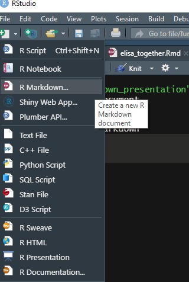
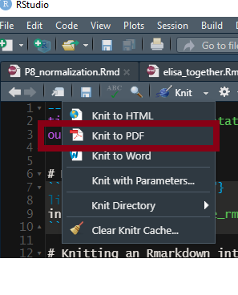
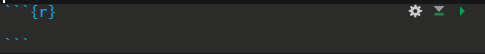
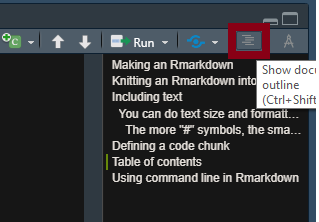

# Making an Rmarkdown
```{r, out.width = "20%"}
library(knitr)

```

# Knitting an Rmarkdown into pdf
```{r, out.width = "20%"}

```

# Including text
If you want to include text explanations in normal text size, you can just include text outside of any code block like this.

### You can do text size and formatting by including "#" symbols, and a space, before the text line.
###### The more "#" symbols, the smaller the text, to a limit (I don't know the limit)

# Defining a code chunk
A code chunk is defined by three tick marks, a set of curly brakets, and a keyword that tells the chunk what kind of code it'll run. It looks like this: 
```{r, out.width = "20%"}

```


# Options within code chunks

## Figure height and width
After the 'r', you can include all kinds of options for formatting that make your output look really nice. One of the things I use most commonly is fig.height and fig.width to scale images. For example, the sizes on the following figure are much too large, change them so that the final product looks really nice! This only works for R-generated figures. For images that you insert, use "out.width" instead (see above code chunks)
```{r, fig.height = 2, fig.width = 4}
# some code to plot something
x <- seq(1, 20, by = 0.5)
y <- seq(1, 20, by = 0.5)
plot(x, y)
```

## DPI
We can make really high resolution graphics for publication using the dpi option
```{r, dpi = 1000, fig.height = 2, fig.width = 4}
plot(x, y)
```

## Hide warnings
If there's a warning that you decided is ok, but you don't want it printing out every time and cluttering your view, you can hide it. Set warning to FALSE to hide.
```{r, warning=TRUE}
warning("testit")
```
## Hide code
Similarly, you may not want a giant chunk of code in your final pdf, depending on the use case (usually the transparency is good). You can hide the code with 'echo'
```{r, echo = FALSE, fig.height = 2, fig.width = 4}
plot(x,y, main = "Same plot as above, but this time with no code", cex.main = 0.75)
```

## Default options
If you find yourself always setting the same options, you can include them as defaults using opts_chunk from the knitr package. From this point onward, all plots will have width 4 and height 2, so normally we'd put this chunk at the very top of the script.
```{r}
knitr::opts_chunk$set(fig.width=4, fig.height=2) 
```

Defaults will work only when you knit, not interactively
```{r}
plot(x, y, main = "See look, the defaults work")
```

## Figure captions
```{r, fig.cap="This is a caption"}
plot(x, y)
```

## Setting figure path
Most likely, we'll want to set up one figure path where all of our saved figures will go, so we should do that globally at the beginning of the script, like this:
```{r}
knitr::opts_chunk$set(fig.path = "path_to_figures/")
# now all of our figure paths can be saved relatively to that
```

## Writing options within a code chunk
You may find yourself using LOTS of options, especially when displaying figures. For clarity in your code, you can actually set the chunk options within the code itself. These options will be invisile in the final printout
```{r}
#| fig.width = 4,
#| fig.height = 6,
#| fig.caption = "This is a long caption that fits better inside of a code chunk",
#| fig.alt= "This is a long description that conveys the meaning of the visual",

plot(x,y)
```

# Table of contents
This feature allows fast and easy navigation, and is a good incentive to organize your code well. Try clicking on the items in the table of contents to navigate there
```{r, out.width = "20%"}

```

# Evaluation options

## eval = F
This argument will make the chunk invisible to Rmarkdown, so you can knit the whole pdf without including buggy code or code that throws errors. The code chunk will still be printed in the final markdown
```{r, eval = F}
#throw a test error
stop("error message")
```

## include = F
This argument prevents both code and results from being displayed in the final pdf, but Rmarkdown will still run the code, and store the variables locally. So while they are invisible, we can use them downstream. Here is code that you can't see in the final pdf, but that declares a variable my_var
```{r, include = F}
my_var <- seq(1, 5, by = 0.5)
```

Printing out the invisible variable my_var
```{r}
print(my_var)
```

# Using command line in Rmarkdown
You can also run other programs within Rmarkdown, like Python or bash. You'll define that in the code chunk. Below, I print out all of the file paths that bash knows to look in. You can also add file paths to the path like this:
```{bash, eval = F}
echo $PATH
export PATH="/c/Program Files/NCBI/blast-:$PATH"
```

Let's use this trick to run a simple BLAST command within Rmarkdown! Note that I've added the folder that contains my local BLAST installation to my PATH already
```{bash, eval = F}
# Query an example fasta I had from Grace against the online blast database
# You'll notice this is quite a bit slower that using blast through the command line! For large jobs it's not worth it, but sometimes it's convenient
blastn -query "example_fasta1.fasta" -max_target_seqs 1 -db nt -remote -outfmt 6 -perc_identity 95 
```

